# Experiment 1 - Decision Tree on Binary Classification

Complete with command to run on test set: `./642test-$(uname -p) exp1_model.pkl`

### Q1: What hyperparameters did you vary, and what values did you try? What were some trends you observed?

I have tried to adjust `min_samples_splitint`, `min_samples_leaf` and `max_depth` hyperparameters of the decision tree. I have tried to increase the value of `min_samples_splitint` and `min_samples_leaf`, however, the accuracy of the prediction decreased. But when increasing `max_depth`, it can be observed that the accuracy increases as well.

### Q2: Provide an image of the trained decision tree. Discuss what you observe.

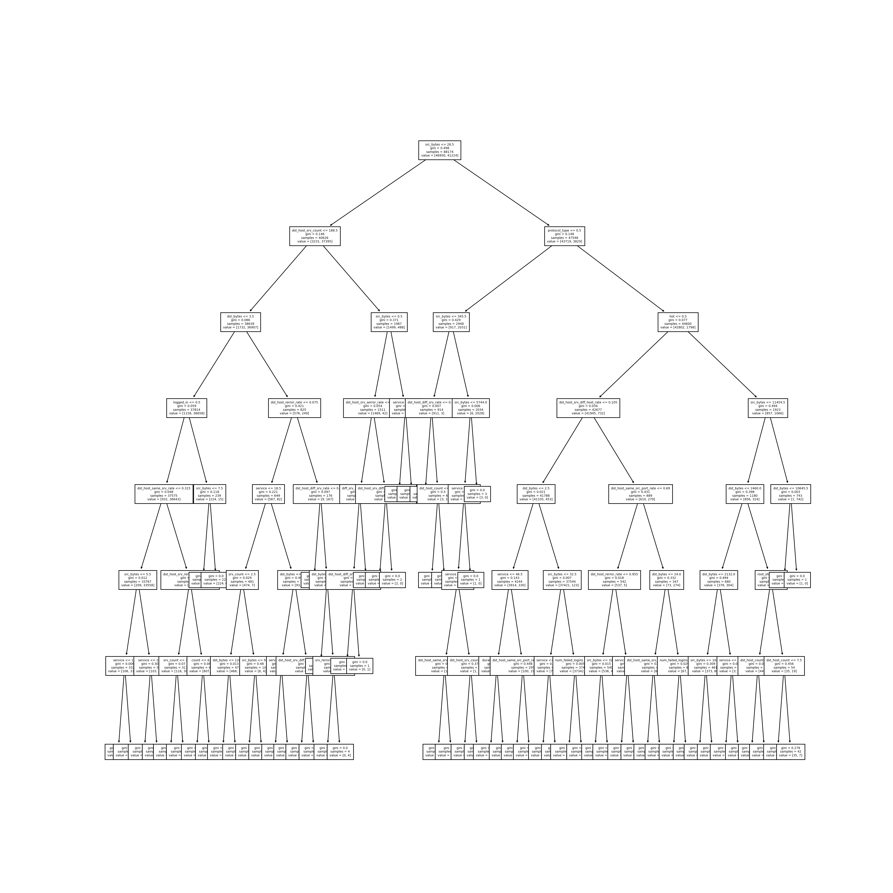

`src_bytes` can be seen in a lot of nodes in the tree. It can be deduced that different rules are set for different sizes of data packets and there are few leaves that were generated at the first few layers even the sample sizes of the nodes are quite small. I suspect that it was because these are the edge cases.

### Q3: Provide a plot of the feature importance. What were some of the most important features? Why do you think these features were important?

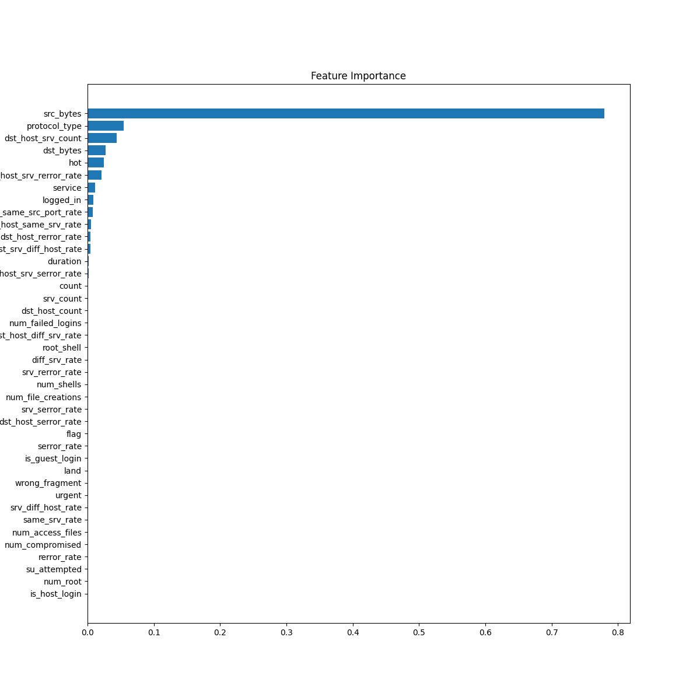

We can tell `src_byte`, `protocol_type`, `dst_host_srv_count` are the top 3 most significant features. One interpretation is that based on `src_bytes`, if it is one of the protocols that requires a large data exchange, it may be benign, otherwise, it is not malicious. If DoS attack comes from a single machine, `dst_hostsrv_count` would be a huge factor for sure.

### Q4: Plot a confusion matrix on the validation data. Discuss what you observe.

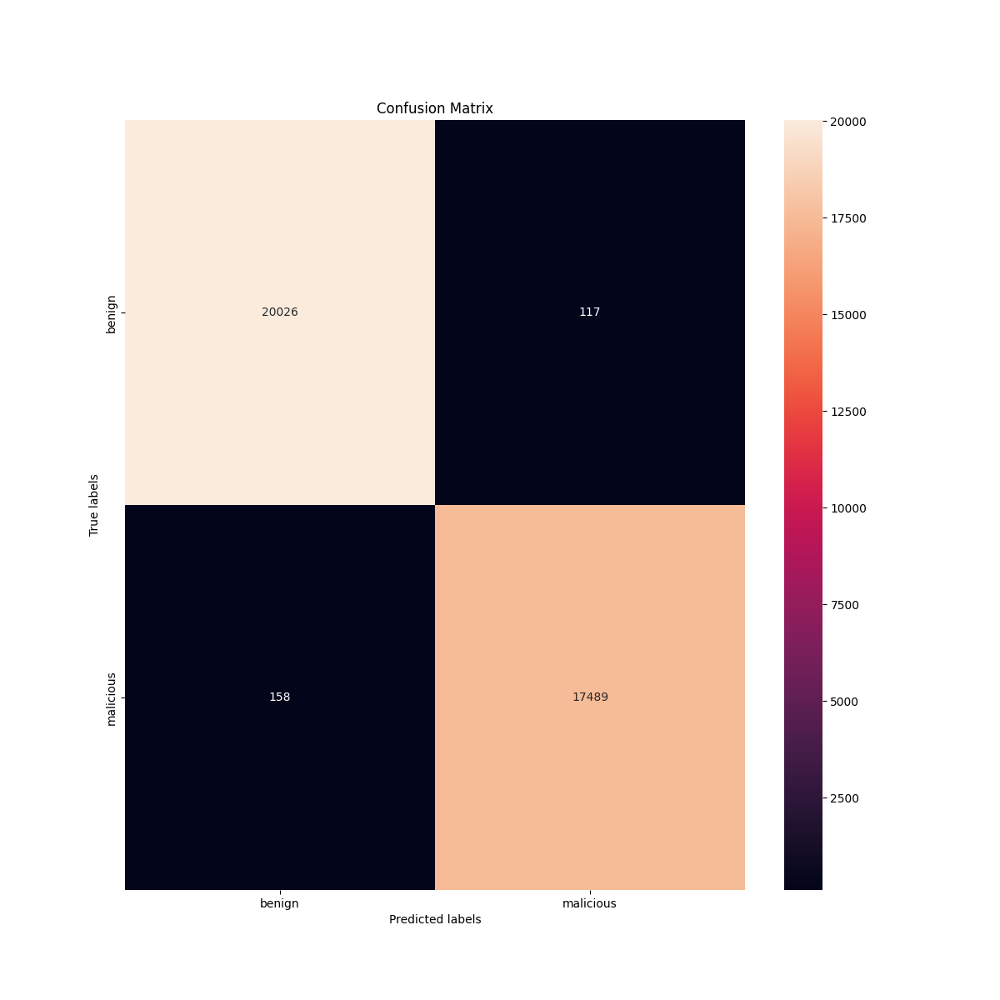

Majority of the data packets are accurately categorized, which means the accuracy rate and sensitivity rate is good. 

### Q5: Plot a ROC curve on the validation data. What do you find to be the optimal threshold for predicting something as positive?

Since there are only 3 points (thresholds: [inf, 1, 0]), and the point on the top left point has the lowest false positive rate and highest true positive rate, therefore, the optimal threshold is 1.

---
---

# Experiment 2 - Decision Tree on Multiclass Classification

Complete with command to run on test set: `./642test-$(uname -p) exp2_model.pkl`

### Q1: What hyperparameters did you vary, and what values did you try? What were some trends you observed?

I manipulated the hyperparameters `min_samples_splitint`, `min_samples_leaf` and `max_depth`. The trend of prediction accuracy resembles experiment 1: when increasing `min_samples_splitint` or `min_samples_leaf`, the accuracy of the prediction decreased; increasing `max_depth` up to 10 could observe significant accuracy improvement.

### Q2: Provide an image of the trained decision tree. Discuss what you observe.

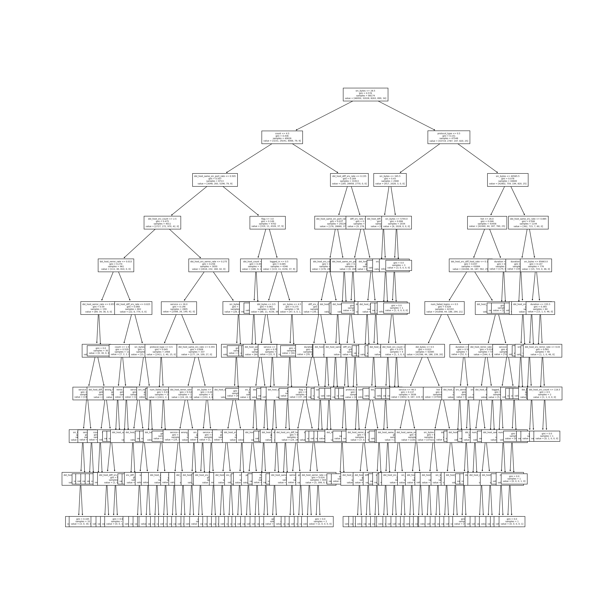

The first node still involves `src_byte` as in the decision tree for the experiment 1. In addition to that, the complexity of the tree is obviously much greater the decision tree for the experiment 1. The leaves would only appear at the last two layers, which again represents the complexity of categorizing 5 labels.

### Q3: Provide a plot of the feature importance. What were some of the most important features? Why do you think these features were important?

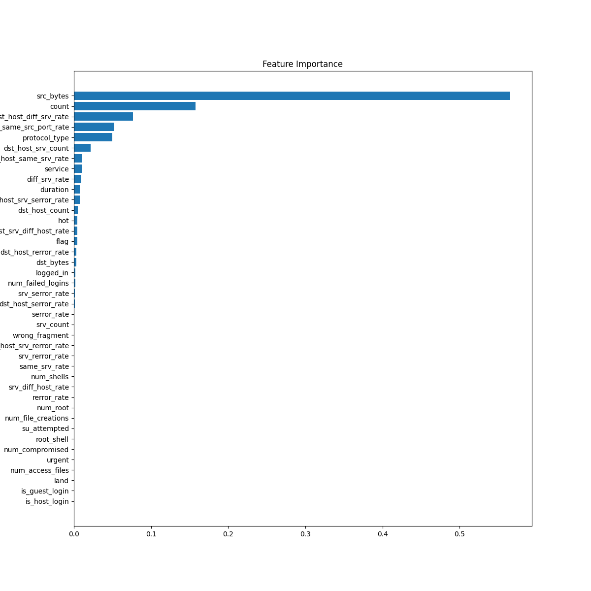

`src_byte`, `protocol_type`, `dst_host_srv_count` are the top 3 most significant features. It is a same question as the one for the experiment 1 and since the result is the same, I think the reason should also be the same: "One interpretation is that based on `src_bytes`, if it is one of the protocols that requires a large data exchange, it may be benign, otherwise, it is not malicious. If DoS attack comes from a single machine, `dst_hostsrv_count` would be a huge factor for sure."

### Q4: Plot a confusion matrix on the validation data. Discuss what you observe.

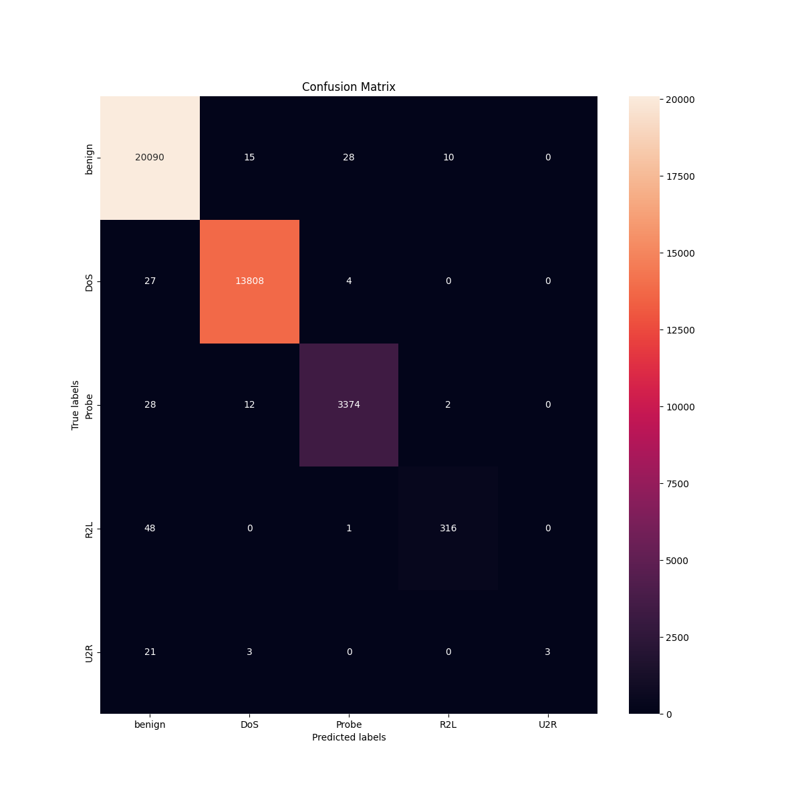

Majority of benign, DoS, and Probe data packets are accurately detected by the model and the true positive rates of these three classes are high. However, true positive rates of U2R and R2L data packets are not good. It could be due to the limited training data of R2L and U2R in the data set.

---
---

# Experiment 3 - Neural Network on Binary Classification

Complete with command to run on test set: `./642test-$(uname -p) exp3_model.pkl` 

### Q1: What hyperparameters did you vary, and what values did you try? What were some trends you observed?

I have tried to manipulate the number of layers and the number of neurons in a layer. It can be observed that the accuarcy increases as the number of layers or the number of neurons in a layer increases.

### Q2: Provide a plot of the loss curve over the epochs trained. What do you observe as the number of epochs increases?

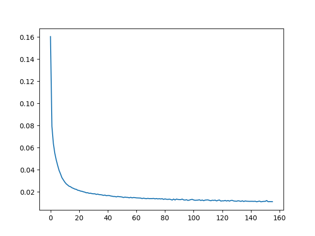

The loss value decreases as the number of epochs increases. However, after 60 epochs, the loss values did not decrease obviously and the decreases are not stable.

### Q3: Plot a confusion matrix on the validation data. Discuss what you observe.

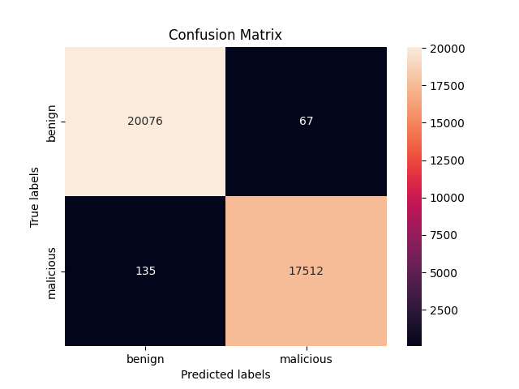

The true positive rate of the model is high, also the false positive rate is quite low, which means that the model can predict really accurately and precisely.

### Q4: Plot a ROC curve on the validation data. What do you find to be the optimal threshold for predicting something as positive?

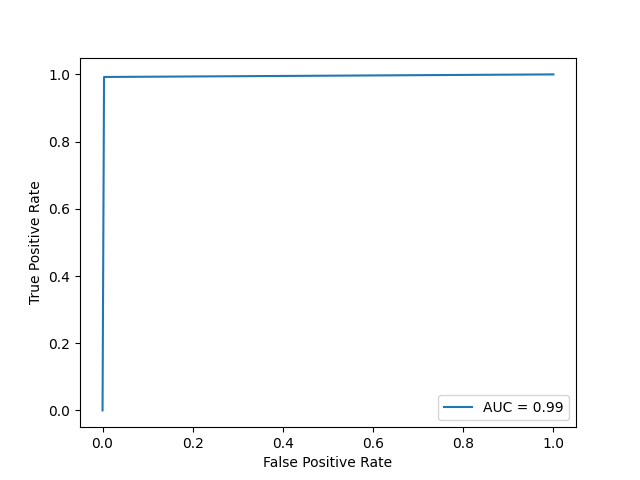

Since there are only 3 points (thresholds: [inf, 1, 0]), and the point on the top left point has the lowest false positive rate and highest true positive rate, therefore, the optimal threshold is 1.

---
---

# Experiment 4 - Neural Network on Multiclass Classification

Complete with command to run on test set: `./642test-$(uname -p) exp4_model.pkl` 

### Q1: What hyperparameters did you vary, and what values did you try? What were some trends you observed?

I have tried to manipulate the number of layers and the number of neurons in a layer. It can be observed that the accuarcy increases as the number of layers or the number of neurons in a layer increases.

### Q2: Provide a plot of the loss curve over the epochs trained. What do you observe as the number of epochs increases?

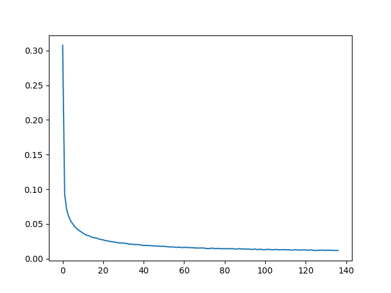

The loss value decreases as the number of epochs increases.

### Q3: Plot a confusion matrix on the validation data. Discuss what you observe.

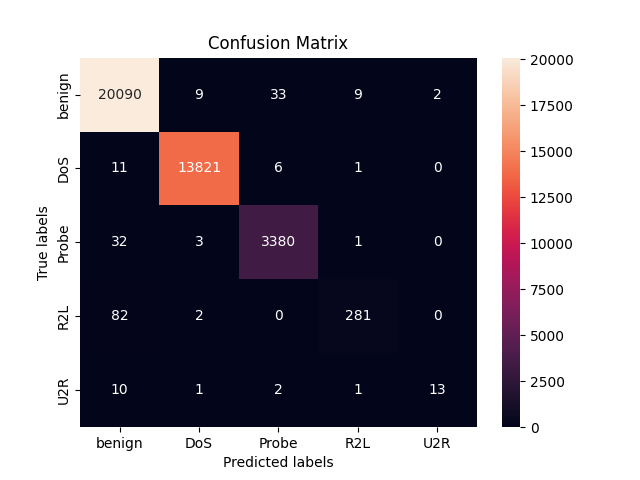

Majority of benign, DoS, and Probe data packets are accurately detected by the model and the true positive rates of these three classes are high. However, true positive rates of U2R and R2L data packets are not good. It could be due to the limited training data of R2L and U2R in the data set.
